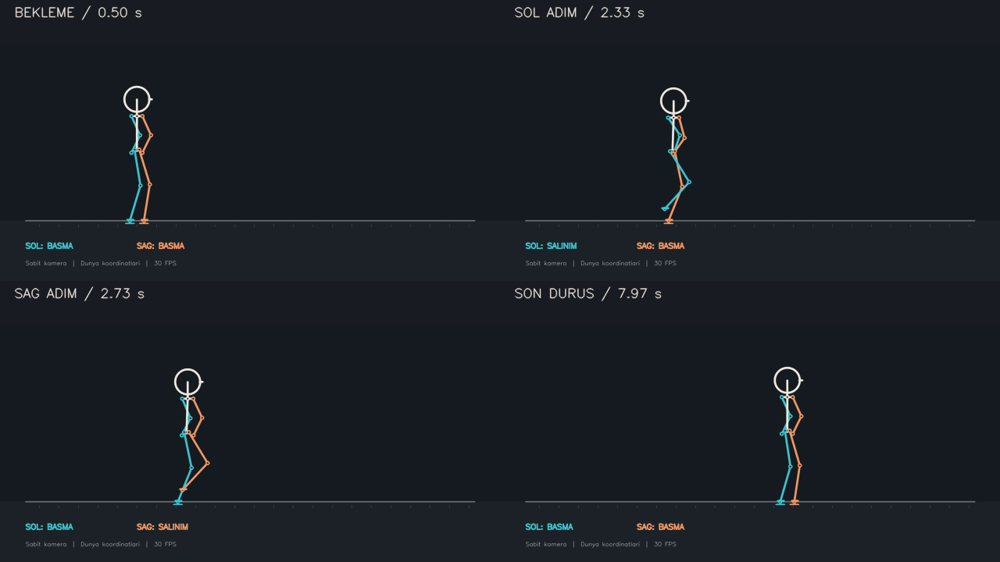
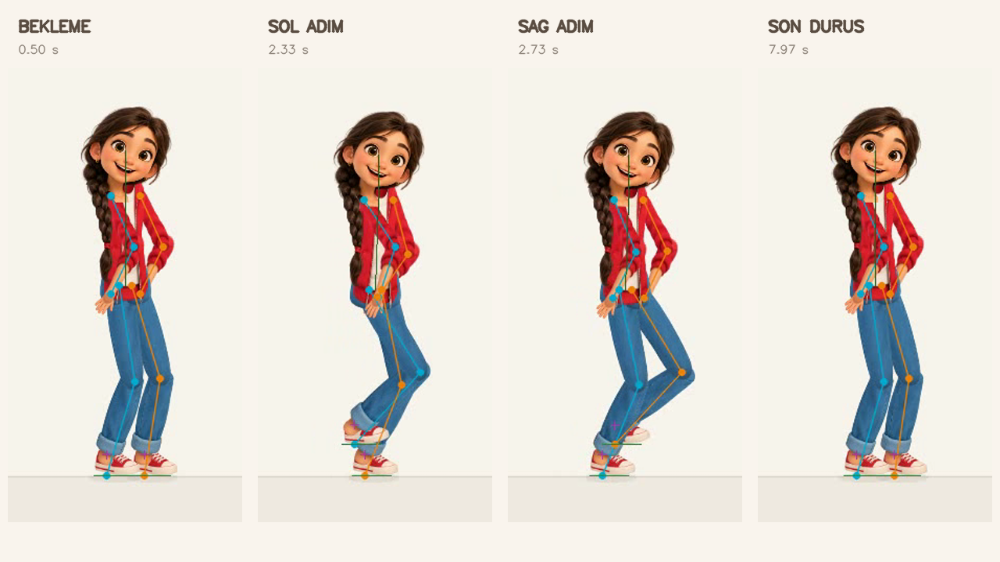
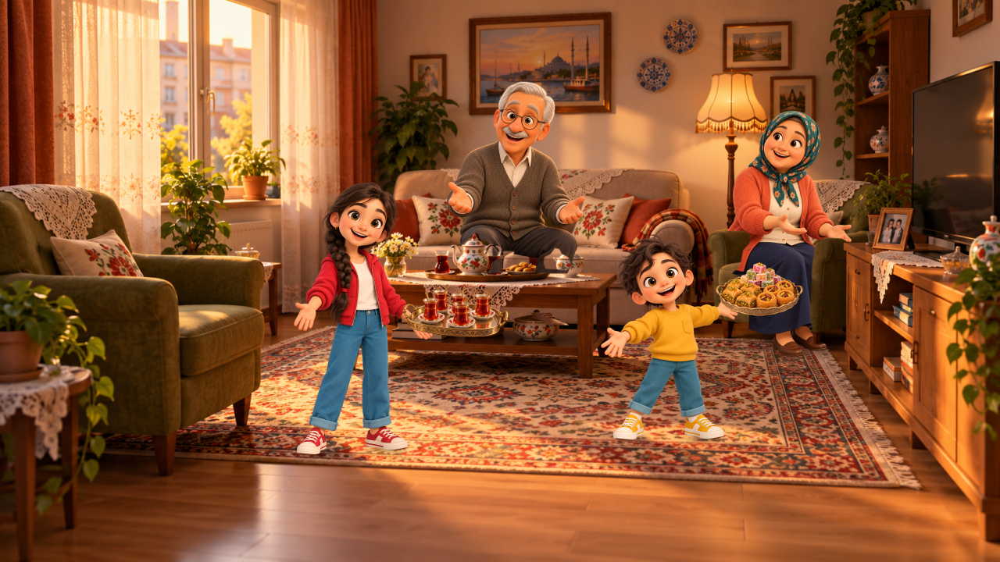

# Zehra için Möbius değişiklik notları
Sahne yönetimi, Bilge iskelet yürüyüşü ve parçalı 2D karakter animasyonu


## İncelemeye nereden başlamalı?

Önerilen sıra: `demo/bilge_walk_validation.py` →
`scene/skinning.py` → `demo/bilge_walk_skinned.py` → ilgili testler.
Misafirlik sahnesi için `demo/step6_scenario_timeline.py` ve `scene/` modüllerini inceleyin.

Commit'ler sahne altyapısı, iskelet testi, parçalı görünüm ve belgeler olarak ayrılmıştır.
MP4'ler `outputs/` altında yeniden üretilir; GitHub incelemesi için aşağıdaki
önizlemeler ve ölçüm raporları saklanır. `.gitignore`, yerel çıktıları,
`.venv/` ve macOS `.DS_Store` dosyalarını dışarıda tutar.

### Aynı hareket: iskelet ve Bilge






### Ayrı misafirlik sahnesi



Ölçümler: [iskelet raporu](validation/bilge_walk_validation_report.json),
[görsel parçalar ve taban teması](validation/bilge_walk_skinned_report.json).
Parça üretiminin kaynağı ve tam istem:
[rig açıklaması](../assets/characters/bilge_rig/README.md),
[görsel üretim istemi](../assets/characters/bilge_rig/generation_prompt.txt).

## Kurulum

```bash
python3 -m venv .venv
source .venv/bin/activate
python3 -m pip install numpy opencv-python
```

Bilge yürüyüşleri sessizdir. Misafirlik sahnesine ses eklemek için ayrıca
`ffmpeg` PATH üzerinde bulunmalıdır; yoksa sahne sessiz çıktı üretir.


## 1. Genel olarak ne yaptık?

Mevcut fizik ve hareket motorunu koruyup üzerine sahne yönetimi ve iskelete bağlı karakter çizimi ekledik. Önce Bilge'nin yürüyüşünü yalnızca iskeletle doğruladık. Ardından aynı eklem koordinatlarını kullanarak Bilge'nin görsel parçalarını bu iskelete bağladık.

Bu değişiklik setinde README.md, INDEX.md ve .gitignore güncellendi. Sahne katmanı, Bilge demoları, görsel parçalar, testler ve bu inceleme belgeleri eklendi. physics/ içindeki motor dosyaları ve eski fizik demoları değiştirilmedi. Bilge yürüyüşünde step15/step16 kullanılmıyor.

Dosya yolları proje köküne göredir.

## 2. Bilge yürüyüşü için eklenen dosyalar

**demo/bilge_walk_validation.py**
Mevcut physics.gait.FootPlantingLeg ile adımları, physics.fabrik.FabrikChain2D ile eklem konumlarını hesaplayan bağımsız yürüyüş demosu. Çocuk oranları, sırayla adım atma, karşı bacakla uyumlu kol salınımı ve yumuşak başlangıç/duruş burada ayarlandı. Destek ayağı kayması, zemin ihlali, kemik uzunlukları ve diz yönü ölçülüyor. Ayarlar WalkConfig içinde toplandı.

**demo/prepare_bilge_rig.py**
Referanstan hazırlanan görsel atlasını ayrı PNG parçalarına ayırıyor. Baş ve yüzü özgün bilge_happy.png dosyasından alıyor; bağlantı ayarlarını rig.json içine yazıyor. Yeniden çalıştırıldığında paketleme ayarlarını yeniden üretir.

**scene/skinning.py**
Bir PNG parçasındaki iki bağlantı noktasını iskeletteki iki ekleme eşleyen dönüşümleri hesaplıyor. Parçaları konumlandırıyor, ölçekliyor ve döndürüyor. Saydam kenarları düzgün birleştirmek için alfa işlemleri, küçük dokularda titreşimi azaltmak için ön filtreleme yapıyor. Yeni bir hareket simülasyonu içermiyor.

**demo/bilge_walk_skinned.py**
bilge_walk_validation.simulate(WalkConfig()) çıktısını değiştirmeden kullanıyor. Bilge'nin parçalarını bu koordinatlara bağlıyor. Parçaların çizim sırası, ayakkabı tabanı/bilek ofseti, temas gölgeleri, parça örtüşme kontrolleri ve video üretimi burada. Normal görüntüde iskelet çizgileri yok; --debug seçeneği ayrı kontrol çıktıları üretiyor.

**assets/characters/bilge_rig/rig.json**
Parça dosyalarını, normalize bağlantı noktalarını (anchor/end), görünüm genişliklerini ve kaynak bilgilerini saklıyor. Normal video üretimi bu ayarları okuyor.

**assets/characters/bilge_rig/**
16 ayrı saydam parça içeriyor: baş, gövde, kalça, örgü, iki üst kol, iki ön kol, iki el, iki üst bacak, iki alt bacak ve iki ayakkabı. Ham atlas atlas.png içinde; kullanılan görsel üretim istemi generation_prompt.txt içinde; paketleme ve kullanım açıklamaları README.md içinde.

Görsel kaynağı hakkında açıklama: Baş/yüz, özgün Bilge PNG'sinin RGB piksellerinden alındı; başı ve boynu ayırmak için yalnızca alfa maskesi uygulandı. Diğer parçalar ve görünmeyen eklem yüzeyleri, aynı Bilge görseli referans verilerek yerleşik imagegen aracıyla hazırlandı. Özgün karakter dosyası değiştirilmedi. Görsel üretimi hazırlık aşamasında yapıldı; video kareleri kod tarafından çiziliyor.

## 3. Misafirlik sahnesi için eklenen dosyalar

**scene/actor.py**
Karakterin konumunu, ölçeğini, dönüşünü, görünürlüğünü ve ifadesini yönetiyor. Elde taşınan nesneler için bağlama/ayırma işlemleri ve iskelet adaptörü için arayüz içeriyor. Bu arayüzün bulunması, tüm karakter davranışlarının otomatik olarak fizik motoruna bağlandığı anlamına gelmiyor.

**scene/timeline.py**
Eylemleri saniye bazında zamanlıyor ve geçişlerini hesaplıyor. Örneğin bir karakterin belirli bir saniyede görünmesi veya bir konumdan diğerine ilerlemesi burada yönetiliyor.

**scene/actions.py**
Taşıma, ölçekleme, döndürme, görünürlük, ifade değiştirme, nesne bağlama, kamera hareketi ve saydamlık geçişleri gibi eylemleri tanımlıyor.

**scene/sprite.py**
PNG yükleme ve önbellekleme yapıyor. Bir görsel eksik olduğunda geçici gösterim sağlıyor.

**scene/camera.py**
Kamera konumu, yakınlaştırma ve dünya koordinatlarının ekran koordinatlarına dönüşümünü hesaplıyor.

**scene/compositing.py**
Görselleri konum, ölçek, dönüş, saydamlık ve çizim sırasına göre tek karede birleştiriyor. Karaktere bağlı nesneleri ve parça çizimlerini destekliyor.

**scene/staging.py**
PNG'nin şeffaf kenar boşlukları yerine görünür alfa sınırına göre boyutlandırma yapıyor. Oturma ve ayak temas noktalarını hizalıyor. Düz salon görselinden ön plan mobilya maskeleri çıkarıyor; ışık ve temas gölgeleri sağlıyor.

**scene/export.py**
MP4 çıktısını oluşturup temel çıktı kontrollerini yapıyor. Gerektiğinde ffmpeg ile şarkının seçilen bölümünü videoya ekliyor.

**scene/__init__.py**
Sahne sınıflarını ortak paket üzerinden kullanılabilir hâle getiriyor.

**demo/step6_scenario_timeline.py**
“Misafiri Severiz” sahnesini kuruyor. Şarkının 10–14. saniyelerine karşılık gelen dört saniyelik video üretiyor. Salon, karakterler, ikram nesneleri, yerleşim ve zamanlama bu demoda birleştiriliyor. Bilge yürüyüş testi bu sahneden ayrı tutuldu.

**assets/layouts/step6_misafiri_severiz.json**
Karakter ölçeklerini, oturma ve ayak temas noktalarını, mobilya maskelerini ve yerleşim ayarlarını saklıyor.

**assets/characters/, assets/backgrounds/, assets/props/, assets/audio/**
Bilge ve aile karakterleri, salon arka planı, çay/tatlı tepsileri ve Türküz Biz şarkısı eklendi. assets/README.md dosyası görsellerin proje içinde nasıl kullanılacağını açıklıyor.

## 4. Testler ve dokümantasyon

**tests/test_bilge_walk_validation.py**
Destek ayağının sabitliği, bacak uzunlukları, zemin sınırı, adım sırası, kol-bacak uyumu ve başlangıç/duruş davranışını test ediyor. Ölçümlerin bozuk bir ayak konumunu yakaladığını da kontrol ediyor.

**tests/test_bilge_skinning.py**
Özgün yüz piksellerinin korunmasını, parçaların eklemlere bağlanmasını, ayakkabı temasını, uzuvların dönmesini ve çizim sırasında iskelet verisinin değişmemesini test ediyor. Debug görüntüsünün isteğe bağlı olduğunu da kontrol ediyor.

**tests/test_scene.py**
Zamanlama, karakter işlemleri, kamera, görsel birleştirme, ses ekleme ve video çıktısı testlerini içeriyor.

**tests/test_staging.py**
Görünür alfa sınırına göre boyutlandırma, mobilya teması, ön plan maskeleri ve ışık işlemlerini test ediyor.

**tests/smoke_demos.py**
Eski demoları geçici çıktı klasöründe çalıştıran kontrol aracı. Bu araç eski demoları değiştirmiyor. Bilge yürüyüşü hazırlanırken temel step2, step3 ve step4 demoları ayrıca çalıştırılıp doğrulandı. Step15/16, Bilge yürüyüşüne entegre edilmedi.

**test_scene_modules.py**
Test paketini başlatan uyumluluk giriş dosyası.

**README.md — değiştirildi**
Yeni sahne mimarisi, Bilge yürüyüşü, parçalı karakter çizimi, çalıştırma komutları, ölçümler ve sistemin sınırları belgelendi.

**INDEX.md — değiştirildi**
Yeni dosyaların görevleri ve ürettikleri çıktılar proje dosya haritasına eklendi.

## 5. Çıktılar ve kontrol sonucu

**outputs/bilge_walk_validation.mp4**
Yalnızca çizgi ve eklemlerle gösterilen iskelet yürüyüşü.

**outputs/bilge_walk_validation_preview.png**
Bekleme, sol adım, sağ adım ve son duruş kareleri.

**outputs/bilge_walk_validation_report.json**
İskelet yürüyüşünün sayısal ölçümleri.

**outputs/bilge_walk_skinned.mp4**
Bilge'nin parçalı görsellerle yürüdüğü normal video: 1280×720, 30 FPS, 8 saniye.

**outputs/bilge_walk_skinned_preview.png**
Normal videodan alınan dört duruşun büyütülmüş önizlemesi.

**outputs/bilge_walk_skinned_report.json**
İskelet ölçümleriyle birlikte parça örtüşmeleri ve ayakkabı temasının ölçümleri.

**outputs/bilge_walk_skinned_debug.mp4**
İskelet eklemleri, görsel bilek noktaları ve taban temaslarını gösteren kontrol videosu. Ayrı debug önizlemesi ve JSON raporu da üretiliyor.

Son kontrolde toplam 34 test geçti. Normal ve debug videolarının 240 kare, 30 FPS ve 1280×720 olduğu doğrulandı. Başlangıç, adım ve duruş kareleri görsel olarak incelendi. Kontrol edilen parça bağlantıları tüm karelerde örtüşüyor. Ayakkabılarda görünür zemin ihlali 0 piksel; kenar yumuşatma/raster ölçümü nedeniyle taban ile zemin arasındaki fark en fazla 1 piksel. Destek ayakkabısının hareketi sayısal yuvarlama düzeyinde.

## 6. Çalıştırma ve mevcut sınırlar

İskelet testi:
```bash
python3 demo/bilge_walk_validation.py
```

Bilge görselli video:
```bash
python3 demo/bilge_walk_skinned.py
```

Debug videosu:
```bash
python3 demo/bilge_walk_skinned.py --debug
```

Tüm testler:
```bash
python3 -m unittest discover -s tests -v
```

Bu çalışma sabit kamera için hazırlanmış parçalı 2D karakter animasyonudur. Kalçanın ilerlemesi kontrollü bir hareket eğrisinden geliyor; ayaklar mevcut ayak basma mekanizmasıyla hareket ediyor ve eklemler FABRIK ile çözülüyor. Tam dinamik denge simülasyonu değildir. Ayak basma mekanizması kare tabanlı olduğundan bu test 30 Hz için ayarlandı.

Bu kamera açısındaki yürüyüş için eksik görsel parça yok. Arkadan görünüş veya tam yan profile dönüş istenirse ayrı kafa, saç, gövde, el ve ayakkabı açıları gerekecek. Parçalı Bilge yürüyüşü henüz misafirlik sahnesine entegre edilmedi; bağımsız demo olarak tutuluyor.
